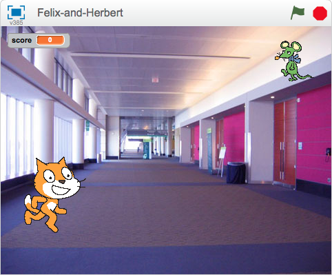

---
title: Felix và Herbert
level: Level 1
language: vi-VN
stylesheet: scratch
embeds: "*.png"
materials: "Felix-and-Herbert.sb2"
note: "notes for club leaders.md"
...

# Giới thiệu { .intro}
Chúng ta sẽ cùng làm một trò chơi đuổi bắt với __mèo Felix__ và chuột __Herbert__. Hãy dùng chuột để điều khiển Herbert và cố gắng không bị Felix bắt được. Càng tránh được lâu bạn sẽ càng được nhiều điểm, nhưng cố gắng đừng để bị bắt vì điểm số của bạn sẽ giảm! 



# BƯỚC 1: Felix di chuyển theo con trỏ chuột { .activity}

## Bảng liệt kê các hoạt động cần kiểm tra { .check}

+ **Start a new program.**

+ Click vào **stage** bên cạnh hình sprit và chuyển sang thẻ `Backdrops` {.blocklightgrey}, sau đó click vào nút `Choose Backdrop from library` {.blocklightgrey} và chọn backdrop indoors/hall. Xóa backdrop trống ban đầu.  

+ Click vào hình sprit, và sau đó click vào nút `i` kéo đến phía trái của hình sprit. Đổi tên của hình sprite thành **Felix**.
+ Đảm bảo Felix chỉ di chuyển trái - phải khi click vào nút này: 
+ **Create this script**:

```blocks
				when FLAG clicked
				forever
					point towards [mouse-pointer v]
					move (10) steps
					next costume
					play drum (3 v) for (0.3) beats
				end
```

##Chạy thử chương trình{ .flag}

**Click the green flag.**

Felix có di chuyển theo đúng hướng con trỏ chuột không? Khi di chuyển, chú mèo có trông giống như đang đi bộ không? Tốc độ di chuyển đã ổn chưa? 

##Lưu lại dự án của bạn { .save}


#**Step 2:**   Felix đuổi theo Herbert {.activity}

*Next, we want Felix to chase Herbert the mouse, rather than the mouse pointer.*

##Bảng liệt kê các hoạt động cần kiểm tra { .check}

+ Tạo 1 hình sprit khác sử dụng nút `choose sprite from library` {.blockgrey} và chọn **animals/mouse1**.
+ Đổi tên của hình sprit thành **Herbert**.
+ Chuyển sang thẻ __Costumes__, sau đó click vào trang phục ở Paint Editor. 1 hộp sẽ hiện ra xung quanh trang phục. Kéo 1 góc hộp để làm Herbert nhỏ hơn Felix.  
+ Đảm bảo Herbert chỉ di chuyển trái - phải.
+ **Give Herbert this script:**

```blocks
  when FLAG clicked
    forever
      go to [mouse-pointer v]
      point towards [Felix v]
    end
```

##Chạy thử chương trình { .flag}

**Click the green flag.**

Does Herbert move with the mouse pointer? Does Felix chase Herbert?

##Save your project { .save}


#**Step 3:**   Felix says when he’s caught Herbert {.activity}

**We want Felix to know when he’s caught Herbert, and tell us.**

##Activity Checklist { .check}

+ **Change Felix’s script to be this:**

```blocks
  when FLAG clicked
  forever
    point towards [mouse-pointer v]
    move (10) steps
    next costume
    play drum (3 v) for (0.3) beats
    if <touching [herbert v]?>
      say [Caught you!] for (1) secs
    end
   end
```

##Test your project { .flag}

**Click the green flag.**

Does Felix say when he’s caught Herbert?

##Save your project { .save}

#**Step 4:**  Herbert turns into a ghost when he’s caught {.activity}

**Instead of Felix saying something, we want Herbert to turn into a ghost when he’s caught.**

##Activity Checklist { .check}

+ **Change Felix’s script to send this message when he catches Herbert:**

```blocks
     when FLAG clicked
        forever
          point towards [mouse-pointer v]
          move (10) steps
          move (20) steps
          next costume
          play drum [3 v] for (0.3) beats
          if <touching [herbert v]?>
            broadcast [caught v]
            play drum [17 v] for (0.2) beats
            wait (1) secs
          end
        end
```

+ Add a new costume into Herbert by selecting Herbert, going into the Costumes section, and clicking the `Choose costume from Library button ` {.blocklightgrey}. Select the **fantasy/ghost2-a** costume.

+ Make the costume smaller by clicking on it in the Paint Editor, and dragging the box that appears, to resize it.

+ Change the names of Herbert’s costumes so the mouse costume is called ‘alive’ and the ghost costume is called ‘dead’.
+ **Create a new script for Herbert to turn him into a ghost:**

```blocks
  when I receive [caught v]
    switch costume to [dead v]
    wait (1) secs
    switch costume to [alive v]

```

##Test your project { .flag}

**Click the green flag.**

Does Herbert turn into a ghost when he’s caught?
Does Felix play the right sounds at the right time?
Does Felix still stay still for long enough for Herbert to get away?

##Save your project { .save}

#**Step 5:**  Keep score {.activity}

**Let’s add a score so we know how well we do at keeping Herbert alive.
We’ll start the score at zero and increase it by one every second. If Felix catches Herbert, we’ll reduce the score by one hundred.**

##Activity Checklist { .check}

+ Make a variable, for all sprites, called Score. Click on `Data` {.blockorange} in the top menu, make a variable and name it `score` {.blockorange}, ensuring that "For all sprites" is selected.
+ **On the stage, create these two scripts:**


```blocks
when gf clicked
   set [score v] to [0]
   forever
      change [score v] by (1)
      wait (1) secs
   end

when I receive [caught v]
change [score v] by (-100)
```

##Test your project { .flag}

**Click the green flag.** 

Does the score go up by one every second?
Does the score go down by one hundred when Herbert is caught?
What happens when Herbert is caught before score reaches one hundred? Does the score go back to zero when you start a new game?

##Save your project { .save}

**Well done you’ve finished, now you can enjoy the game!**

Don’t forget you can share your game with all your friends and family by clicking on **Share** on the menu bar!
