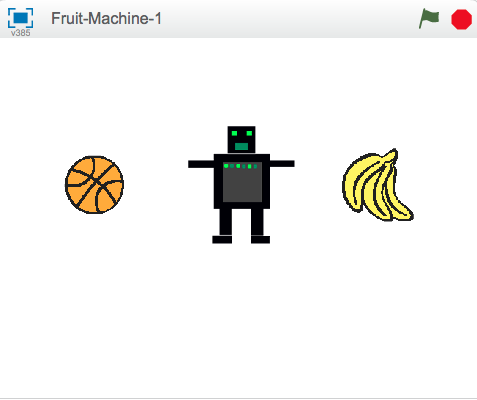

---
title: Máy hoa quả
level: Cấp độ 2
stylesheet: scratch
language: en-GB
embeds: ""*.png""
note: ""notes for club leaders.md""
materials: ""*.sb2""
...

# Giới thiệu {.intro}
Đây là 1 trò chơi đơn giản có 3 hình họa để đổi trang phục. Bạn phải ngăn chúng lại khi chúng hiện ra hình ảnh giống nhau (giống 1 máy hoa quả!).


>>>>>>> scratch2

# BƯỚC 1: Tạo 1 hình họa để đổi trang phục { .activity}

## Những việc cần làm { .check}

__Chúng ta hãy nhập những hình ảnh khác nhau cho trò chơi__

1. Bắt đầu 1 dự án scratch mới. Xóa bỏ hình con mèo bằg cách click vào đó sau đó click “Delete”
2. Đầu tiên, chúng ta hãy thêm 1 hình nền mới từ thư viện hình ảnh. Chọn hình nền  **rays** từ mục **Other** và sau đó xóa bỏ nền trắng ban đầu. 2. Bây giờ thêm 1 hình họa mới từ thư viện.
3. Chọn 1 hình ảnh từ bất kỳ thư mục nào. Chúng ta đã sử dụng **things/Bananas**, nhưng bạn có thể sử dụng bất kỳ hình ảnh nào bạn muốn.
4. Click vào màu xanh '**i**' bên cạnh hình ảnh của sprit trong cửa sổ Sprit, Đặt tên lại hình họa thành 'Fruit'.
5. Bây giờ click vào thẻ Trang phục và nhập thêm 2 loại nữa để có tất cả 3 trang phục (chúng ta đã dùng **things/apple** và **things/watermelon-a**, nhưng bạn có thể dùng bất cứ hình nào mình muốn).

__Bây giờ chúng ta có 1 số trang phục rồi, chúng ta muốn hình họa đổi các trang phục với nhau.__

# BƯỚC 2: Làm hình ảnh thay đổi { .activity}

## Những việc cần làm { .check}

1. Click vào thẻ `Scripts` {.blocklightgrey}.
2. Click vào `Events`{.blockgrey} và kéo 1 khối `when flag clicked` { .blockyellow} vào khu vực script.  Khi chúng ta click vào hình cờ màu xanh thì trò chơi bắt đầu.
3. Click vào thẻ Control, thêm 1 khối `forever` { .blockyellow} và kéo nó rồi thả xuống phần cuối.
4. Click vào hình cờ màu xanh **Click the green flag** ở góc trên bên phải. Lưu ý rằng có 1 đường viền màu vàng ở quan phần script. Nó đang chạy vì chúng ta đã click vào hình cờ xanh, nghĩa là khởi động trò chơi.  
5. Bây giờ click vào `Looks`{.blockgrey} và kéo thả vào phần `next costume` { .blockpurple}
6. Làm sao chúng ta có thể làm chậm tốc độ lại để nó không thay đổi quá nhanh? Click vào thẻ `Control`{.blockgrey} và kéo thả vào khối `wait 1 secs` { .blockyellow}
7. Điều chỉnh thời gian cho đến khi nó lặp lại ở nhịp độ nhanh hơn (đặt khoảng 0.5s là hợp lý). Điều gì sẽ xảy ra nếu chúng ta không có khối `wait 1 secs` { .blockyellow}?

```blocks
when FLAG clicked
forever    	
    next costume
    wait (0.5) secs
```

## Chạy thử chương trình { .flag}
__Click vào cờ màu xanh__
Trang phục có thay đổi ở 1 tốc độ hợp lý không?

## Lưu lại dự án { .save}

## Hãy thử { .try}

- Điều chỉnh thời gian ở khối `wait 1 secs` {.blockyellow}.
- Bạn nghĩ con số nào làm trò chơi trở nên quá dễ, hoặc quá khó?

# BƯỚC 3: Làm trò chơi dừng lại khi click vào đó {.activity}

## Những việc cần làm { .check}

**Tuyệt! Chúng ta có thể dùng hình họa thay đổi trang phục mãi mãi, nhưng làm sao chúng ta có thể khiến nó dừng lại khi click vào đó?**
Một cách để thực hiện điều này là sử dụng 1 biến số để đặt trạng thái của hình họa. Điều này sau này cũng sẽ rất hữu ích sau này...

- Tạo 1 biến số bằng cách click vào `Data` {.blockgrey} và `Make a variable`{.blocklightgrey}. Gọi là `stopped`{.blockorange} và chỉ dùng cho hình họa này, sau đó bỏ dấu tick ở hộp bên cạnh để nó không hiện trên màn hình nền nữa.
- Lúc bắt đầu trò chơi, hình họa sẽ không được click, vì thế chúng ta sẽ đặt biến số bằng với **""NO""**."
```blocks
when FLAG clicked
set [stopped v] to (NO)
forever
    next costume
    wait (0.1) secs
```
- Bây giờ chúng ta sẽ đặt biến số `stopped`{.blockorange} thành  **"YES"** khi click vào hình họa. 
```blocks
    when this sprite clicked
    set [stopped v] to (YES)
```
- Cuối cùng chúng ta cần làm cho hình họa ngừng đổi trang phục khi biến số `stopped`{.blockorange} đổi thành "YES". Thêm 1 vòng lặp `if...then` { .blockyellow} và sử dụng 1 khối điều hành  **equals** `[] = []` {.blockgreen} mới (ở bên dưới thẻ *Operators*) để kiểm tra xem `stopped`{.blockorange}  có phải vẫn là "NO" không.
```blocks
when FLAG clicked
set [stopped v] to (NO)
forever    
     if <(stopped) = [NO]> then
     next costume
     wait (0.5) secs
```

## Chạy thử chương trình { .flag}
__Click vào cờ màu xanh lá cây, đợi 1 chút, sau đó click vào hình họa__ 

- Nó có thay đổi trang phục trước khi click vào đó không?
- Nó có dừng lại khi click vào đó không?
- __Bắt đầu chương trình một lần nữa.__ Nó có dừng lại khi đặt con trỏ chuột trên đó mà không click không?
- Hình họa có dừng khi khi bạn click ở bất kỳ chỗ nào trên màn hình nền không?   

## Lưu lại dự án { .save}

# Bước 4: Tạo hình họa khác {.activity}
__Bây giờ chúng ta cần tạo những hình họa khác để có thể chơi trò chơi của chúng ta!__

## Những việc cần làm { .check }

1. **Nhân đôi hình họa** (trái cây) bằng cách click phải lên trên hình ở góc phải bên dưới.
2. Nhân đôi một hình họa lần nữa để có **3** hình họa trên màn hình.
3. Di chuyển mỗi hình họa để chúng cùng ở trên 1 đường thẳng. Chỉnh cho hình này nhỏ hơn nếu cần.

## Chạy thử chương trình { .flag}

__Click vào hình cờ màu xanh.__ Tất cả các hình họa nên thay đổi. Cố gắng dừng tất cả trên cùng 1 hình ảnh bằng cách click vào từng hình một!

## Lưu lại dự án { .save}

# Bước 5: Bắt đầu mỗi hình họa với 1 bộ trang phục bất kỳ { .activity}
__Chúng ta hãy dùng hình họa đổi thành 1 bộ trang phục bất kỳ khi click vào hình cờ xanh.__

Khi bắt đầu trò chơi ngay sau khi tải, tất cả các hình họa có cùng 1 trang phục và sau đó thay đổi theo liên kết.
Nếu chúng đổi trang phục theo cách khó đoán hơn, trò chơi sẽ trở nên thú vị (và khó hơn).

## Những việc cần làm { .check}

- Nếu nhìn vào bên dưới thẻ `costumes`{.blocklightgrey} cho 1 hình họa, bạn sẽ thấy mỗi bộ trang phục có 1 con số. Bạn có thể xác định 1 hình họa mặc trang phục gì bằng cách sử dụng tên hoặc con số.  
- Để 1 hình họa bắt đầu với 1 bộ trang phục bất kỳ, hãy thêm 1 khối  `switch costume to` { .blockpurple} với  `pick random (1) to (3)` { .blockgreen} để chọn số trang phục.
- Chúng ta cũng có thể sử dụng chính xác cùng 1 khối cho vòng lặp `forever`{.blockyellow} để hình họa chuyển sang 1 bộ trang phục khác mỗi lần nó thay đổi trong suốt trò chơi.
```blocks
when FLAG clicked
set [stopped v] to (0)
switch costume to <pick random (1) to (3)>
forever    
     if <(stopped) = [NO]> then
     switch costume to <pick random (1) to (3)>
          wait (0.5) secs
```
- Làm giống như vậy cho mỗi hình họa.

## Chạy thử chương trình { .flag}
__Click vào hình cờ màu xanh.__ Tất cả các hình họa nên đổi trang phục theo 1 tiến trình khó đoán.

Nếu muốn thêm 1 bộ trang phục khác thì chúng ta cần thay đổi đoạn chương trình như thế nào?
 
## Lưu lại dự án { .save}

##Hãy thử { .try}
 
  __Làm trò chơi trở nên khó hơn__

Thay đổi độ khó của trò chơi theo 1 cách nào đó. Nếu chỉ làm trang phục thay đổi nhanh hơn thì khá dễ. Liệu bạn có thể nghĩ ra cách gì giàu trí tưởng tượng hơn không? Một vài ý tưởng có thể bạn muốn thử:

+ Đổi số của trang phục mà mỗi hình họa có.
+ Để 1 vài hình họa có những trang phục độc nhất.
+ Đặt khoảng thời gian khác nhau giữa những lần đổi trang phục.

 __Hãy vui vẻ thưởng thức những thứ của riêng mình!__
 
Mỗi lần thay đổi, hãy nghĩ xem nó làm trò chơi dễ hơn hay khó hơn. Liệu trò chơi có quá dễ hoặc quá khó không? Làm sao có thể điều chỉnh được độ khó để nó ở mức vừa phải?

## Bước 6: Hiển thị 1 tin nhắn khi trò chơi kết thúc. { .activity}
__Chúng ta hãy làm hiển thị tin nhắn "Game Over" cho người chơi khi họ kết thúc__

## Những việc cần làm { .check}

Đầu tiên, chúng ta hãy tạo 1 hình nền khác để hiển thị khi trò chơi kết thúc.

- Click vào sàn chơi và chọn thẻ `Backdrops`{.blocklightgrey}. Đổi tên hình nền hiện tại thành **"GameOn"**.
- Nhân đôi hình nền và sau đó thêm 1 vài từ vào bản copy thể hiện **"Game Over"**. Có thể thay đổi kích cỡ chữ bằng cách click vào đó và kéo 1 trong các góc. Đổi lại tên hình nền thành **"GameOver"**.
- Click vào thẻ `Scripts`{.blocklightgrey cho sàn chơi và đặt hình nền "GameOn" hiển thị khi trò chơi bắt đầu.   
- Làm sao có thể phát hiện được khi tất cả các hình họa dừng lại? Hãy nhớ rằng chúng ta sử dụng biến số `stopped`{.blockorange} để lưu lại xem mỗi hình họa đã được click chưa? Chúng ta hãy kiểm tra biến số `stopped`{.blockorange} cho hình họa **Fruit3** để xem trò chơi đã dừng lại chưa. Chọn hình họa Fruit3 và sau đó sử dụng khối `x position of Fruit3` { .blockblue} từ thẻ `Sensing`{.blocklightgrey}, nhưng đổi **x position** thành `stopped`{.blockorange}.
```blocks
when FLAG clicked
switch backdrop to [GameOn v]
forever
     if <([stopped v] of [Fruit3 v]) = [YES]> then
           switch backdrop to [GameOver v]
```

## Chạy thử chương trình { .flag}
__Click vào lá cờ màu xanh.__ Thông điệp "Game Over" có xuất hiện trên màn hình khi bạn click vào Fruit3 ?

Điều gì diễn ra nếu bạn dừng Fruit3 trước khi bạn click vào cả hai hình họa trái cây còn lại? Hãy thay đổi chương trình sao cho chúng hoạt động không phụ thuộc vào thứ tự các hình họa dừng lại.

5. Kiển tra để chắc rằng biến `stoped ` của __cả ba __ hình trái cây {.blockorange} đã chuyển sang trạng thái **YES**, chúng ta có thể sử dụng toán tử `and` {. blockgreen} . Đây là một đoạn khá khó để ghép lại nên hãy cố gắng lắp ráp chúng từng bước một.

```blocks
	when FLAG clicked
switch backdrop to [GameOn v]
forever
    if <<<([stopped v]  of [Fruit1 v]) = [YES]> and <([stopped v]  of [Fruit2 v]) = [YES]>> and <([stopped v]  of [Fruit3 v]) = [YES]>> then
        switch backdrop to [GameOver v]
```

## Kiếm tra dự án { .flag}
__Click vào lá cờ màu xanh.__ Thông điệp "Game Over" có xuất hiện trên màn hình khi tất cả ba trái cây đều dừng lại, không phụ thuộc vào thứ tự bạn click vào chúng?

# Lưu lại dự án { .save }

# Bước 7: Thông báo cho người chơi rằng họ thắng hay thua cuộc chơi { .activity }

__Mục đích của trò chơi là click vào các hình họa trong khi chúng giống nhau. Chúng ta nên đưa ra màn hình một thông điệp cho người chơi rằng họ thắng hay thua.__

## Những việc cần làm { .check }

- Chúng ta sẽ viết một đoạn mã để kiểm tra khi trò chơi kết thúc ở __bước 6__, và việc duy nhất chúng ta phải làm là kiểm tra xem người chơi có thắng cuộc hay không. Quay lại hình nền và thêm một vài dòng vào hình nền GameOver và cũng như là đưa ra màn hình từ **"WIN"**. Sau đó đổi tên nó thành **"Win"**.
- Sao chép hình nền một lần nữa và  tạo thông điệp **"Lose"** trên đó. Đặt tên nó là **"Lose"**.
- Bây giờ chúng ta cần một vài đoạn chương trình để khiến cho các hình nền vừa được tạo hoạt động. Chúng ta có thể sử dụng `if...then...else` { .blockyellow} để biết rằng người chơi thắng hay thua bằng cách so sánh `costume #`{.blockpurple}  (số lượng custome) sử dụng đoạn code khá giống với đoạn  `x position of Sprite` { .blockblue} mà ta đã xây dựng lúc trước. Bây giờ, thay vì việc quan tâm đến biến `stopped`{.blockorange}, chúng ta có thế kiểm tra `costume #`{.blockpurple}  và xem xem Fruit1  Fruit2, Fruit3 có cùng costume hay không.
```blocks
     when FLAG clicked
switch backdrop to [GameOn v]
forever
    if <<<([stopped v]  of [Fruit1 v]) = [1]> and <([stopped v]  of [Fruit2 v]) = [1]>> and <([stopped v]  of [Fruit3 v]) = [1]>> then
     if <<([costume # v]  of [Fruit1 v]) = ([costume # v]  of [Fruit1 v])> and <([costume # v]  of [Fruit2 v]) = ([costume # v]  of [Fruit3 v])>> then
           switch backdrop to [Win v]
        else    
                switch backdrop to [Lose v]
```
 
## Kiếm tra dự án { .flag}
__Click vào là cờ màu xanh.__ Những thông điệp xuất hiện khi game xuất hiện có chính xác không? Điều gì xảy ra nếu các costume của các hình họa không giống nhau (ví dụ, nếu costume 3 của Fruit2 là một quả táo còn costume 3 của Fruit3 là một quả dưa?

## Lưu lại dự án { .save}
   
__Bạn đã hoàn thành xuất sắc dự án của mình. Có khá nhiều thứ thú vị có thể làm tiếp với trò chơi của bạn. Hãy thử các thử thách sau!__

##Challenge: Khiến cho trò chơi khó hơn và dễ hơi theo thời gian { .challenge}

Những người khác nhau có trình độ chơi khác nhau. __Bạn có thể thay đổi trò chơi như thế nào độ khó của nó có thể thay đổi theo trình độ người chơi?__

Một cách bạn có thể làm là __điều chỉnh tốc độ thay đổi của costume__. Bạn có thể sử dụng biến `delay`{.blockorange}, để tạo ra một khoảng thời gian chờ trong từng đoạn chương trình của các hình họa. Nếu người chơi thắng cuộc, khoảng thời gian chờ  có thế rút ngắn lại một chút (để khiến cho trò chơi khó hơn). Nếu người chơi thua cuộc, khoảng thời gian chờ có thể tăng lên một chút (để khiến trò chơi dễ hơn).

Bạn có thể nghĩ về việc thay đổi cách khởi động trò chơi thay vì `when flag clicked`{.blockyellow}. Sau đó bạn có thể lưu giá trị của biến được nhớ giữa các hiệp của trò chơi.

## Lưu lại dự án { .save}

__Rất tốt, bạn đã hoàn tất. Bây giờ bạn có thể trải nghiệm trò chơi của mình__
Đừng quên rằng bạn có thể chia sẻ trò chơi của mình với bạn bè và người thân bằng cách click nút __Share__ ở thanh menu.
