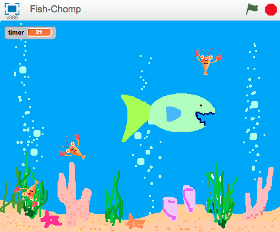

---
title: Cá bắt mồi
level: Cấp độ 2
language: vi-VN
stylesheet: scratch
embeds: "*.png"
note: "notes for club leaders.md"
materials: "*.sb2"
...


# Giới thiệu { .intro}
Chúng ta sẽ làm trò Fish Chomp! Điều khiển con cá lớn đang đói và cố gắng ăn hết những con mồi bơi xung quanh.



# BƯỚC 1: Tạo một hình họa chạy theo con trỏ màn hình { .activity}
__Hãy làm con cá đang đói bơi xung quanh biển__

## Hoạt động { .check}

1. Bắt đầu một dự án mới.
2. Chọn stage, backdrop. Chọn hình nền __Nature/underwater3__ bằng cách nhấn nút `choose background from library
`{.blocklightgrey}. Cuối cùng, bỏ **backdrop1**
3. Thay đổi tên của Sprite1 thành ‘Hungry Fish’ bằng cách nhấp chuột vào biểu tượng chữ ‘i’ màu xanh.
4. Nhập hình Hungry Fish, **resources/hungry-fish.png** rồi xóa **costume1** và **costume2** đang có sẵn.
5. Click vào biểu tượng chữ ‘**i**’ màu xanh một lần nữa, mà đảm bảo là hình họa chỉ có thể xoay trái-phải.
6. Bây giờ, tạo lệnh cho Hungry Fish để nó di chuyển theo con trỏ xung quanh biển như sau:

```blocks
when FLAG clicked
    forever    	
        point towards [mouse pointer v]
        move (3) steps
```

## Chạy thử { .flag}

__Click vào biểu tượng lá cờ màu xanh.__ 
Di chuyển con trỏ chuột xung quanh biển. Con cá có đi theo con trỏ không?
Chuyện gì sẽ xảy ra nếu bạn không di chuyển con trỏ chuột và con cá theo kịp nó? Trông con cá lúc đó thế nào? Và tại sao nó lại làm như vậy?

1. Bạn có thể dừng việc Hungry Fish xoay chiều liên tục bằng cách làm nó di chuyển chỉ khi nó ở quá gần con trỏ
(Dùng khối `distance to`{.blocklightblue} trong bảng `Sensing`{.blocklightgrey}).


```blocks
when FLAG clicked
    forever if <(distance to [mouse-pointer v]) > (10)>
        point towards [mouse-pointer v]
        move (3) steps
```

## Lưu lại tiến độ của bạn { .save}

## Có thể thử thêm { .try}


Nếu bạn muốn, bạn có thể cho số khác nhau vào lệnh. Việc này có ảnh hưởng gì đến việc di chuyển có con cá? Thay đổi khoảng cách lên số lớn( VD: 100), hoặc số nhỏ hơn (VD: 1). Thay đổi số lần di chuyển của con cá lên số lớn (VD: 20), hoặc nhỏ (VD: 1 hoặc 0).


# BƯỚC 2: Thêm con mồi { .activity}
__Đã đến lúc làm gì đấy cho con cá ăn rồi!__

## Hoạt động  { .check}


1. Tạo một hình họa mới trong thư viện, dùng **Animals/starfish**
2. Dùng côn cụ `Shrink`{.blocklightgrey} (ở trên Stage) để làm hình họa nhỏ hơn.
3. Tạo lệnh để làm những con mồi bơi xung quanh. Chúng ta muốn chúng di chuyển ngẫu nhiên, nên hãy làm chúng tiến lên một chút, rồi quay một chút, sang trái hoặc phải, rồi lặp lại.


```blocks
when FLAG clicked
	forever		
        move (2) steps
        turn right (pick random (-20) to (20)) degrees
        if on edge, bounce  
```

## Chạy thử { .flag}

__Click vào biểu tượng lá cờ màu xanh__ rồi xem những con mồi di chuyển. Chúng có bơi như bạn mong muốn? Chúng có thực sự đang bơi?

__Tại thời điểm này, con hungry Fish và những con mồi chưa có tương tác, chúng ta sẽ làm việc này trong bước sau.__

## Lưu lại tiến độ của bạn { .save}

## Có thể thử thêm { .try}

* Thử thay đổi số trong `pick random`{.blockgreen}
 và di chuyển các khối. Việc này làm những con mồi di chuyển khác như thế nào?
* Khối `If on edge, bounce`{.blockblue} có tác dụng gì? Bỏ nó đi và xem chuyện gì xảy ra.

# BƯỚC 3: Hungry Fish ăn mồi { .activity}

__Bây giờ chúng ta muốn làm con cá ăn những con mồi!__ Một khi con cá bắt được mồi trong miệng nó, hai việc cần xảy ra:
* Con Hungry Fish cần ngậm miện lại là tạo ra âm thanh nuốt con mồi.
* Con mồi cần biến mất, rồi xuất hiện lại sau đó một lúc.

## Hoạt động { .check}

1. Đầu tiên, hãy làm con mồi biến mất khi nó chạm vào con Hungry Fish, rồi xuất hiện lại sau 3 giây. Dùng khối `touching`{.blocklightblue} để xem liệu nó có chạm vào con cá không.

```blocks

forever    	
		move (2) steps
		turn right (pick random (-20) to (20)) degrees
		if on edge, bounce
		if <touching [Hungry Fish v]?> then
			hide
			wait (3) secs
			show
```

## Chạy thử { .flag}

__Thử lại trò chơi - bạn có gặp vấn đề gì không?__ Hãy để ý, con mồi có thể biến mất dù nó chạm vào bất kì bộ phần nào của con cá. Vì thế, con cá có thể đứng yên đợi 3 giây để con mồi xuất hiện lại rồi ăn nó tiếp. Như vậy không công bằng!
2. Làm thế nào để đảm bảo con mồi chỉ biến mất khi nó chạm vào miệng con cá? Chúng ta có thể dùng khối `touching color`{.blocklightblue}, và xem nếu con mồi chạm vào răng màu xanh của con cá không. Để làm việcnaày, bỏ khối `touching`{.blocklightblue} và thay bằng `touching color`{.blocklightblue} trong lệnh cũ, chọn màu trong khối và click vào răng con cá.
3. Tiếp theo, chúng ta có thể làm con mồi di chuyển đến một vị trí bất kì trên màn hình trước khi xuất hiện trở lại bằng cách dùng khối `go to`, và cho nó một giá trị **x** và **y** ngẫu nhiên.

```blocks
when FLAG clicked
	forever		
		move (2) steps
		turn right (pick random (-20) to (20)) degrees
		if on edge, bounce
		if <touching color [#FFFFFF]?> then
			hide
			wait (3) secs
			go to x:(pick random (-220) to (220)) y: (pick random (-170) to (170))
			show
```
    
## Chạy thử { .flag}

Thử chơi lại trò chơi – Con mồi có biến mất chỉ khi nó chạm vào miệng con cá không? Và nó có xuất hiện trở lại tại một điểm bất kì thay bằng tại điểm nó bị ăn không?

4. Con cá cần biết khi nó ăn được con mồi để có thể tạo ra âm thanh và đổi màu da của nó. Để làm được việc này, chúng ta cần khối `broadcast`{.blockyellow} chỉ ra việc con mồi đã bị ăn trước khi biến mất.

```blocks

when FLAG clicked
forever		
	move (2) steps
	turn right <pick random (-20) to (20)> degrees
	if on edge, bounce
	if <touching color [#FFFFFF]?>
		broadcast [got me v]
		hide
		wait (3) secs
		go to x:<pick random (-220) to (220)> y: <pick random (-170) to (170)>
		show
	
```
__Bây giờ chúng ta cần con cá phản hồi lại bằng việc tạo ra âm thanh và ngậm hàm lại.__

5. Thêm hình **resources/mouth-closed.png** và âm thanh **resources/chomp.mp3** cho hình họa Hungry Fish.
6. Sau đó, thêm lệnh mới cho Hungry Fish để phản ứng lại tin `broadcast` của con mồi. Đoạn lệnh này cần làm con cá tạo tiếng động và chuyển sang hình `mouth-closed`{.blockyellow}, đợi một lúc rồi chuyển đổi trở lại.

```blocks
when I receive [got me v]
	play sound [chomp v]
	repeat (2)
		switch to costume [mouth-closed v]
		wait (0.5) secs
		switch to costume [hungry-fish v]
```

__Bây giờ Hungry Fish đã sẵn sàng đi ăn mồi, hãy phủ đầy con mồi trong nước biến. Click chuột phải vào hình họa con mồi và nhấn "Duplicate" vài lần.__

## Chạy thử { .flag}
__Click biểu tượng lá cờ màu xanh.__
Con cá có ăn mồi không? Và nó có ăn các con mồi khác nhau không?

## Lưu lại tiến độ của bạn { .save}

## Nghĩ thêm:
Tại sao chúng ta cần thêm khối `show`{.blockblue} để bắt đầu dòng lệnh cho con mồi? Nghĩ xem chuyện gì sẽ xảy ra nếu con mồi bị ăn, sau đó trò chơi dừng lại trước khi tiếp tục. Chuyện gì sẽ xảy ra nếu trò chơi bắt đầu lại?

__Tốt lắm! Bạn đã hoàn thành trò chơi cơ bản. Có nhiều thứ khác bạn có thể sáng tạp với trò chơi này. Bạn có sẵn sàng thử thách?__

## Thử thách 1: Làm con mồi di chuyển khác đi { .challenge}


Hiện tại, tất cả các con mồi đều di chuyển cùng chiều. __Bạn có thể làm một con trong số chúng di chuyển khác đi?__ __Gợi ý:__ Không cần dành quá nhiều thời gian cho việc này mà bỏ qua những hoạt động khác trong dự án.


__Chọn một con mồi để thử nghiệm.__ Nếu chúng có cùng vẻ ngoài, làm chúng khác đi bằng cách thay đổi màu sắc với khối `set color effect`. Bằng cách này, bạn có thể phân biệt chúng với những con còn lại.


Làm con mồi này bơi chậm hơn các con khác. __Gợi ý:__ Nhìn vào khối `move 2 steps`{.blockblue}.


## Chạy thử { .flag}

Con mồi có di chuyển chậm hơn không? Việc này có làm trò chơi thú vị hơn không?
Nếu bạn làm được việc đó, __hãy thử làm một con mồi di chuyển nhanh hơn các con mồi khác.__


Con mồi vẫn di chuyển như bình thường chứ? Những thay đổi này có làm trò chơi thú vị hơn không?

__Gợi ý:__ Nếu con mồi bơi quanh vòng tròn, kiểm tra lại giá trị của khối `pick random`{.blockgreen} trong khối `turn`{.blockblue}.

Bạn nghĩ sao về việc làm mỗi con mồi di chuyển khác nhau bằng cách kết hợp những thay đổi trên?


Những thay đổi này có làm trò chơi hay hơn, thú vị hơn, khó hơn hay dễ hơn không?


## Lưu lại tiến độ của bạn { .save}

## Thử thách 2: làm những con mồi tránh Hungry Fish { .challenge}


Những con mồi trong trò này rất ngu xuẩn! Chúng chỉ bơi xung quanh cho đến khi bị ăn. Những con mồi thật thường bơi xa khỏi kẻ thù của chúng. __Hãy làm con mồi chạy khỏi Hungry Fish__

Không có khối nào trong Scratch cho bạn biết trước đường đi của hình họa. Nhưng bạn có thể làm một hình họa chỉ về phía một hình khác, sau đó làm nó quay đi hướng khác. Nhứng khối bạn cần nằm trong bảng `Motion`{.blocklightgray}.


Với ý tưởng này, __làm một con mồi quay đầu ra hướng khác con cá.__


Bạn có thể thấy những con mồi bị kẹt ở góc nếu chúng luôn bơi ra khỏi con cá. Bạn muốn con mồi chỉ bơi đi xa khi con cá lại gần. __Gợi ý:__ xem lại cách chúng ta dùng khối `distance to`{.blocklightblue}.


## Chạy thử { .flag}
Việc này có khiến việc bắt mồi khó hơn không? Nó có làm trò chơi tốt hơn không?

## Lưu lại tiến độ của bạn { .save}

## Thử thách 3: Thêm điểm số { .challenge}
Chỉ ăn mồi là chưa đủ.  Làm thế nào để bạn biết bạn chơi tốt hơn người khác? __Bạn cần tìm cách ghi lại điểm số, nên hãy thêm bảng ghi điểm.__ Nhìn vào __Keep score scratch card__ để xem cách làm.

Bạn nên để ô ghi điểm ở đâu?


Đảm bảo điểm số về 0 lúc bắt đầu trò chơi. Bạn nên để khối đó ở đâu?


## Chạy thử { .flag}
Điểm số có về 0 lúc trò chơi bắt đầu không? Điểm có tăng dần mỗi khi con cá ăn mồi?


## Lưu lại tiến độ của bạn { .save}

## Thử thách 4: Thêm biến thời gian { .challenge}


__Giới hạn thời gian cho trò chơi.__ Bạn có thể ăn bao nhiêu mồi trong 30 giây?

Nhìn vào __Timer scratch card__ để xem cách thêm bảng tính thời gian. Bắt đầu với 30 giây 


## Chạy thử { .flag}

Timer có phải 30 giây không?

Nó có giảm đúng tốc độ?

Bạn có thể ăn mồi lúc bảng tính thời gian đang chạy không?

Trò chơi có dừng lại khi hết giờ?

## Lưu lại { .save}

## Thử thách 5: Thêm điểm thưởng { .challenge}

Thưởng thêm nhiều điểm nếu bạn có thể ăn hết 3 con mồi một lúc. Làm cách nào để biết bạn đã ăn bao nhiêu con mồi?


__Gợi ý:__ Một cách để làm việc này là __dùng một biến để đếm số mồi đang bơi xung quanh.__


## Lưu lại { .save}

## Thử thách 6: Thay đổi trò chơi: làm con mồi sống! { .challenge}
Đôi khi bạn có thể có ý tưởng tuyệt vời bằng cách lấy một ý tưởng có sẵn và làm ngược lại.

__Giản lược trò chơi bằng cách, thay bằng việc bạn điều khiển một con cá ăn mồi, bạn sẽ điều khiển một con mồi trong biển có rất nhiều Hungry Fish. __ Bạn có thể sống sót trong bao lâu? Thay bằng việc có điểm số, hãy cho con mồi 3 mạng và trò chơi kết thúc khi hết số mạng sống.


## Lưu lại{ .save}


__Tốt lắm! Bạn đã kết thúc. Bây giờ bạn có thể thử chơi!__
Đừng quên bạn có thể chia sẻ trò chơi của bạn với bạn bè và gia đình bằng cách nhấp chuột vào __Share__ ở thanh menu!


